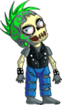

# JS-capstone

 

  

  <h3 align="center">Platform Game JS Capstone</h3>
  <h2 align="center">Zombie endless runner</h2>

## Table of Contents

- [About the Project](#about-the-project)
  - [Built With](#built-with)
- [Game Design](#Game-Design)
- [Getting Started](#getting-started)
  - [Installation](#installation)
- [How to test it](#How-to-play)
- [How to play](#How-to-play)
- [Contact](#Author)
- [Contributing](#Contributing)
- [Acknowledgments](#Acknowledgments)
- [License](#License)

 

 

## Live demo

[live demo](https://romantic-joliot-b264c4.netlify.app/)

## About The Project

This project consists of an endless runner game. Made on phaser 3 I made a full game that consists of an endless runner, where the point of the game is to go as far as you can, You can see a loader scene, title scene, score scene and, the game scene, you must move only by jumping or going down to avoid collapse with the objects that are in the map.

### Built With

- JavasCript
- Phaser
- Jest
- CSS
- HTML

## Game Design

### Introduction

I was requested to build an endless run game, with different scenes. The game consists on go as far as you can. You gain a point for every second you are with life.

### Story and Gameplay

A Zombie apocalypse caused for a virus in 2030 destroyed the civilization, A zombie is a character without any thinking that only goes stray try to find a reason for life avoiding obstacles presented on the world. The main reason for the zombie is to pass the virus to humans and he goes traveling trying to find any human to infected.

### Objective

- Go as far as you can.

### Assets

I created the sprites for the animations because a find the images but not as sprites. With the music, I try to implement a sound post-apocalyptic to make the game more enjoyable. The Acknowledgments of the music is in the Acknowledgments section. I use a background and a ground with different speeds to create the effect of moving.

#### Character

| Asset                                      | character |
| ------------------------------------------ | --------- |
|  | Zombie    |

### Controls

- Press `SPACE` to jump
- Press ⬇️ to move down

## Getting Started

To get a local copy up and running follow these simple example steps.

### Installation

- Open your terminal and cd where you want to store the project
- Run the following command - `git clone https://github.com/BrianSammit/JS-capstone.git`
- Cd into the directory - `cd JS-capstone`
- Then run ` npm npm install`
- Then run ` npm run-script build`
- Open the live server on your VScode Alt + L then Alt + o in the index.html

## How to test it

- Open your terminal
- Cd into the directory - `cd JS-capstone`
- Then run `npm test`
- You should see the test results.

## How to play

To start the game just press the SpaceBar that gonna make the character jump. Then just press the SpaceBar to jump and arrow down to put the character down.

## Author

👤 **Brian Cruz**

- Github: [@githubhandle](https://github.com/BrianSammit)
- Twitter: [@twitterhandle](https://twitter.com/cruzsammit)
- Linkedin: [linkedin](https://www.linkedin.com/in/brian-sammit-cruz-rodriguez-5877551a8/)

## Contributing

Contributions, issues, and feature requests are welcome!

Feel free to check the [issues page](https://github.com/BrianSammit/JS-capstone/issues).

## Show your support

Give a ⭐️ if you like this project!

## Acknowledgments

- The Odin Project
- Rails guides
- Microverse
- March of Midnight by Scott Buckley | www.scottbuckley.com.au
  Music promoted by https://www.chosic.com
  Attribution 4.0 International (CC BY 4.0)
  https://creativecommons.org/licenses/by/4.0/

## License

This project is [MIT](https://github.com/BrianSammit/JS-capstone/blob/development/LICENSE) licensed.![]
